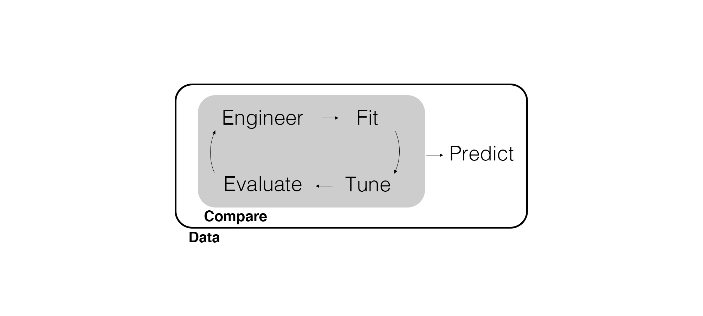
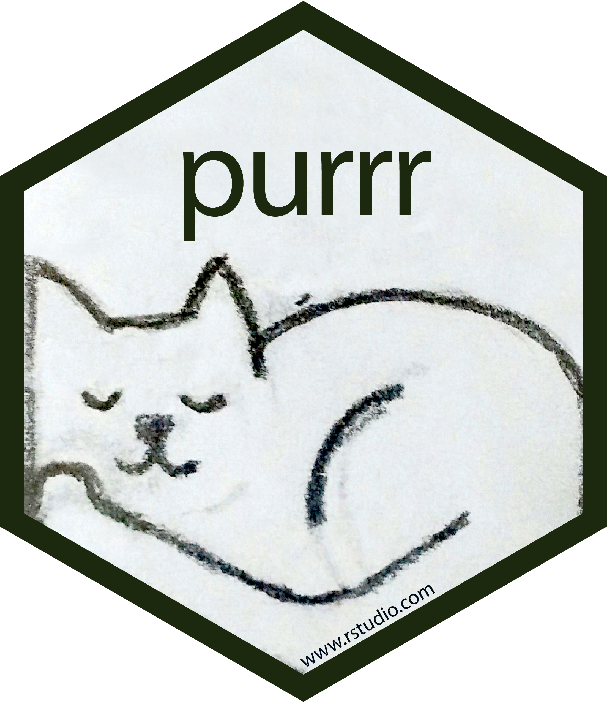

## Student Ratings

It's that time again: [studentratings.byu.edu](https://studentratings.byu.edu).

## Regarding Random Seeds...

When we set a seed, it defines the starting place of the random generator for the current R session. However...

* Packages can reset the seed (without us knowing)
* Packages can interact with the seed in a different way (again - without us knowing)

So...we are going to set a seed in any chunk where we use randomization!

## Marketing Analytics Process

<center>
{width=900px}
</center>

## Predictive Modeling Workflow

<center>
{width=900px}
</center>

---

{width=500px}

## Cluster Analysis

Cluster analysis is a kind of *unsupervised learning*, a model without an outcome variable. We use cluster analysis to find clusters of observations based on two criteria:

- Observations **within the same cluster** are similar.
- Observations **not within the same cluster** are different.

Segmentation is the obvious business application for cluster analysis, most often applied to attitudinal, product purchase, and usage data.

The two most common clustering models are **k-means clustering** and **hierarchical clustering**. Both are based on measures of similarity/dissimilarity (i.e., distance), so we can only cluster on continuous and binary variables.

---

The hardest part with clustering is finding a **meaningful solution** for the given business problem. There is no *right* solution (e.g., slicing the pie). The analyst decides the most useful solution given the relevant business problem.

Other challenges include:

- Determining which continuous and binary variables to use.
- Tuning the number of clusters *k*.
- Ensuring the clusters differ in interesting ways.

---

<center>
{width=850px}
</center>

---

<center>
{width=850px}
</center>

---

<center>
{width=850px}
</center>

---

<center>
{width=850px}
</center>

---

<center>
{width=850px}
</center>

---

<center>
{width=850px}
</center>

---

<center>
{width=850px}
</center>

---

<center>
{width=850px}
</center>

---

<center>
{width=850px}
</center>

---

<center>
{width=850px}
</center>

---

<center>
{width=850px}
</center>

---

<center>
{width=850px}
</center>

## Simulate Data

To illustrate k-means clustering, let's simulate some data where there are obvious clusters. Load the tidyverse and tidymodels and then specify some centroids.

```{r include=FALSE}
# Load packages
library(tidyverse)
library(tidymodels)

seed_num <- 25
```

```{r}
# Simulate centroids.
centroids <- tibble(
  cluster = factor(1:3), 
  x_mean = c(5, 0, -3),
  y_mean = c(-1, 1, -2),
  num_obs = c(100, 150, 50)
)

centroids
```

---

Let's use the centroids to simulate observations in each cluster. We *could* do something like this.

```{r eval=FALSE}
# Simulate observations.
set.seed(seed_num)
N <- sum(centroids$num_obs)
sim_obs <- tibble(x = rep(NA, N), y = rep(NA, N))
for (n in 1:N) {
  # Simulate cluster-specific observations.
  if (n <= centroids$num_obs[1]) {
    sim_obs$x[n] <- rnorm(1, mean = centroids$x_mean[1])
    sim_obs$y[n] <- rnorm(1, mean = centroids$y_mean[1])
  } else if (n > centroids$num_obs[1] & n <= sum(centroids$num_obs[1:2])) {
    sim_obs$x[n] <- rnorm(1, mean = centroids$x_mean[2])
    sim_obs$y[n] <- rnorm(1, mean = centroids$y_mean[2])
  } else {
    sim_obs$x[n] <- rnorm(1, mean = centroids$x_mean[3])
    sim_obs$y[n] <- rnorm(1, mean = centroids$y_mean[3])
  }
}
```
  
---

We can simplify this...someone has to write a for-loop, but it doesn't have to be you!

The `map()` function from {purrr} is a for loop that applies a function to each element of a vector or a list.

```{r}
# Map is a for loop.
map(list(1, 2, 3), log)
```

---

Let's try this again: Use the centroids to simulate observations in each cluster. The `pmap()` function applies a function to each element of a list, but can be applied to multiple vectors at the same time.

```{r}
# we will use pmap to iterate over each row
centroids
```

---

```{r}
set.seed(seed_num)
# Simulate observations.
sim_data <- centroids |>
  mutate(
    # use names in your list that the function (rnorm, in this case) expects
    x = pmap(list(n = num_obs, mean = x_mean), rnorm),
    y = pmap(list(n = num_obs, mean = y_mean), rnorm)
  ) |> 
  # extract the results from each iteration
  unnest(c(x, y))
```

---

```{r}
sim_data
```

---

Now visualize the clusters.

```{r}
# Visualize the clusters.
ggplot(sim_data, aes(x = x, y = y, color = cluster)) +
  geom_point(size = 3, alpha = 0.5)
```

## Fit K-Means

To fit a k-means model, we need to provide the variables we're clustering on and the number of centers (i.e., centroids). The starting place of the centroids is randomized, so be sure to set a seed.

```{r}
# Fit a k-means model.
set.seed(seed_num)
fit_km3 <- sim_data |> 
  select(x, y) |> 
  kmeans(centers = 3)

fit_km3
```

## Evaluate Clusters

This output is *messy*. We can tidy it.

```{r}
# Tidy model output.
tidy(fit_km3)
```

---

To really evaluate clusters, we want to create a **cluster profile**. This looks a lot like the tidy output, except we can profile clusters on more than just the variables that we clustered on.

To do this, we need to append the predicted clusters to the original data with `augment()` and then group by `.cluster` and produce a grouped summary.

Note that the cluster *label* might not match how we simulated the data. This is called **label switching**.

```{r}
# Append predicted clusters.
(initial_clusters <- augment(fit_km3, sim_data))
```

---

Compute profiles. "The average observation for each cluster looks like...". Pretend these are normalized variables `income` and `age`. What clusters did we create?

```{r}
initial_clusters |>
  group_by(cluster) |>
  summarize(across(c(x, y), mean)) |>
  rename(income = x,
         age = y)
```

## Did we "recover" the correct clusters???

```{r}
# Plot the k-means solution.
ggplot(initial_clusters, aes(x = x, y = y, color = .cluster)) +
  geom_point(size = 3, alpha = 0.5)
```

## How Do We Manage the Randomness of K-Means?

Method 1: Use multiple starts!

```{r}
# Fit a k-means model.
set.seed(seed_num)
fit_km3 <- sim_data |> 
  select(x, y) |> 
  # add nstart argument - obtain 10 solutions, take the best one
  kmeans(centers = 3, nstart = 10)

# Append predicted clusters.
better_initial_clusters <- augment(fit_km3, sim_data)
```

## Better Cluster Recovery

```{r}
# Plot the k-means solution.
ggplot(better_initial_clusters, aes(x = x, y = y, color = .cluster)) +
  geom_point(size = 3, alpha = 0.5)
```

## Handling Uncertainty

- We can use multiple starts to overcome uncertainty about which points to assign to which clusters
- What is a another source of uncertainty in cluster analysis?

## Use Hyperparameter Tuning to Choose `k`

The hyperparameter in k-means is `k` itself. Like before, we need to run many models and compare...something?

We can't determine the best model by predictive fit (there isn't an outcome to predict), but we do have measures of model fit. We're interested here in the within-cluster sum of squares.

```{r}
# Glance at model fit.
glance(fit_km3)
```

But that's just for one value of `k`.

---

We *could* do something like this.

```{r eval=FALSE}
set.seed(seed_num)
fit_tune <- vector(mode = "double", length = 9)
for (k in seq_along(fit_tune)) {
  # Fit k-means.
  fit <- sim_data |> 
    select(x, y) |> 
    kmeans(centers = k, nstart = 10)
  
  # Extract model fit.
  fit_tune[k] <- glance(fit)$tot.withinss
}
```

---

Instead of writing a for loop, we can use the `map()` and `pmap()` functions where arguments that we don't want to loop over are included after the function.

```{r}
# Select the clustering variables.
sim_obs <- sim_data |> 
  select(x, y)

# Tune k.
set.seed(seed_num)
fit_tune <- tibble(k = 1:10) |>
  mutate(
    fit_km = pmap(list(centers = k), kmeans, x = sim_obs, nstart = 10),
    model_fit = map(fit_km, glance)
  ) |> 
  unnest(model_fit)
```

---

```{r}
fit_tune
```

---

We can compare the within-cluster sum of squares to produce a **scree plot** (a.k.a., an elbow plot).

```{r eval=FALSE}
# Scree plot.
ggplot(fit_tune, aes(x = k, y = tot.withinss)) +
  geom_point() +
  geom_line()
```

---

This represents the variance within the clusters. It decreases as `k` increases, but has a bend (or "elbow") around `k = 3`. This indicates that additional clusters have little value.

```{r echo=FALSE}
# Scree plot.
ggplot(fit_tune, aes(x = k, y = tot.withinss)) +
  geom_point() +
  geom_line()
```

## Visualizing Different `k` Values

With simulated data, we knew it was 3 cluster all along. But let's visualize results for different `k` values.

```{r}
# Augment the cluster results with the actual data points.
fit_recovery <- tibble(k = 2:7) |>
  mutate(
    fit_km = pmap(list(centers = k), kmeans, x = sim_obs, nstart = 10),
    augment_data = map(fit_km, augment, data = sim_obs)
  ) |> 
  unnest(augment_data)
```

---

```{r}
fit_recovery
```

---

Now we can plot the original observations using the clusters appended with `augment()`.

```{r eval=FALSE}
# Plot each k-means solution.
ggplot(fit_recovery, aes(x = x, y = y)) +
  geom_point(aes(color = .cluster), alpha = 0.5) + 
  facet_wrap(~ k)
```

---

```{r echo=FALSE}
# Plot each k-means solution.
ggplot(fit_recovery, aes(x = x, y = y)) +
  geom_point(aes(color = .cluster), alpha = 0.5) + 
  facet_wrap(~ k)
```

## Wrapping Up

*Summary*

- Began to delve into unsupervised learning with k-means.
- Discussed the `map()` functions for iteration.
- Explored hyperparameter tuning for selecting `k`.

*Next Time*

- Hierarchical clustering.

*Artwork by @allison_horst*

## Exercise 20

1. Simulate data like we did in class but with 5 clusters and an additional discrete variable `z`.
2. Tune `k` where `k = 1:10` and you cluster just on `x` and `y`.
3. Produce a scree plot to compare model fit and choose `k`.
4. Use `augment()` to append the predicted cluster using the best-fitting model and produce a cluster profile as a grouped summary for `x`, `y`, and `z`.
5. Try and name each cluster based on the cluster profile.
6. Render the Quarto document into Word and upload to Canvas.

